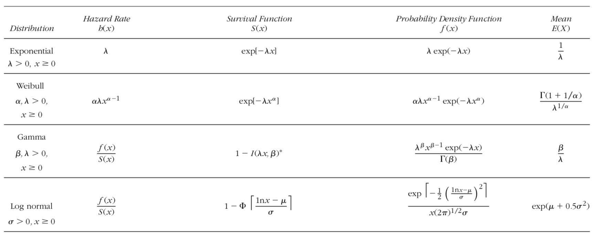

```{r setup, include=FALSE}
knitr::opts_chunk$set(echo = TRUE)
```

# Abstract
In our project, we were interested in analyzing the survival time of patients of breast cancer in the United States. The goal was to find the mean survival time of the patients since the diagnosis of breast cancer. For this project, we used two methods. The Bayesian method reflected more information since the prior distribution of the parameter is needed and it was applied well in estimating parameters. The second method we used is the Bootstrap and Jackknife method, since we might not have knowledge of the distribution of the sample and the parameter in some case. We used these two methods to estimate the mean and calculate the variance of the estimator, and our results of survival time were 8.6 years and 9 years respectively. The two results were relatively close, indicating that our assumptions on the prior distribution and the survival models were reasonable.

# Introduction

In many fields related to medical science and health care, survival analysis is commonly used as evidence to some decisions. A most concerned issue would be estimating the survival time of breast cancer patients. Breast cancer has become the second most common cancer among American women. Currently, the average risk of a US woman developing breast cancer is about 12%, which means that 1 out of 8 women may develop breast cancer sometime in her life. Therefore, investigating the survival time of patients since diagnosis can help analyze trends in breast cancer deaths and breast cancer survivors, which is valuable information for breast cancer researches. It also provides evidence to insurance companies for decision making.
   
So our group is interested in this topic combined with the methods we learned in the class. The problem our group focus on is the mean survival time of the patients since the diagnosis of breast cancer. In this project we apply the following two methods.

The first method we use is Bayesian method. Bayes method reflects more information since the prior distribution of the parameter is needed and it is well applied in estimating parameters.
  
The second method we use is Bootstrap and Jacknife. In many cases, we can not get the information about the distribution of the sample and the parameter. In these scenarios, Bootstrap and Jacknife are powerful methods to estimate the parameter. Thus, we use these two methods to estimate the mean and calculate the variance of the estimator. 
At the end of the paper, we compare the results of the two methods and discuss the strenth of each method.
  
We get data from (https://seer.cancer.gov/csr/1975_2015/browse_csr.php?sectionSEL=4&pageSEL=sect_04_table.14).
  
The original data only shows that the ratio of the survival paptien after certain years since their diagnosis, which is not directly what we want to use, so the data pre-process part is included. 
  
The most part of our code is attached in the Appendix part.

# Method


## Data pre-process


We get data from (https://seer.cancer.gov/csr/1975_2015/browse_csr.php?sectionSEL=4&pageSEL=sect_04_table.14). The data only shows the ratio of patients survived after some year since the diagnosis. Thus, we need generate observations for the survival time of pathients.According to the survival ratio of patients whose dianosis of breast cancer during 1980-1984 ,we generate the 90 samples which are intengers from 1 to 30 and we add noise, which follows $N(0,1)$, to the samples.
```{r,eval=TRUE,echo=TRUE,include=TRUE}
library(readxl)
ratio <- read_excel("~/Desktop/ratio.xlsx")
set.seed(12)
y<-ratio[,2]-ratio[,1]
r_1<-y/sum(y)
p0<-numeric(30)
for(i in 1:30){
  p0[i]=r_1[i,]
}
x<-sample(c(1:30),size=90,replace=TRUE,prob=p0)
x<-abs(x+rnorm(90,0,1))
x # data for survival time
sum(x)
```


## Bayesian Method
We assume that the survival time of the paticent follows Exponential distribution ($exp(\lambda)$) and the average of it is $\lambda^{-1}$. Thus, the problem is to find "good" estimators for $\lambda$. In order to solve our problem, we need to estimate the posterior distribution of the parameter $\lambda$ and use the posterior mean as the estimator. The process involves several integrations and we use Monte Carlo methods to estimate them. 
We assume the prior distribution is $Gamma(2,1)$, so the posterior distribution of $\lambda$: 
$$\frac {\prod_{i=1}^{n}f(x_i|\lambda)g(\lambda)}{C}=\frac {\prod_{i=1}^n\lambda e^{-\lambda x_i}\lambda e^{-\lambda}}{C}=\frac{\lambda^{n+1}e^{-\lambda (\sum_{i=1}^nx_i +1)}}{C}$$
and $C$ is the regularization constant,$C=\int_{0}^{\infty}\lambda^{n+1}e^{-\lambda (\sum_{i=1}^nx_i +1)}d\lambda$


We plug in the observations $X$ and $n=90$ :
$$\frac{\lambda^{91}e^{-814.3935\lambda}}{\int_{0}^{\infty}\lambda^{91}e^{-(814.3935)\lambda}d\lambda}$$
Thus, the first intgration we are intersted in is that:
$$\int_{0}^{\infty}\lambda^{91}e^{-(814.3935)\lambda}d\lambda$$
Since we intend to use the expectation of the posterior mean as an estimator for $\lambda$ and the expectation of the posterior is :
$$E(\lambda)=\frac{\int_{0}^{\infty} \lambda^{92}e^{-814.3935\lambda}d\lambda}{\int_{0}^{\infty}\lambda^{91}e^{-(814.3935)\lambda}d\lambda}$$
Thus, the second integration we are interested in is that :
$$\int_{0}^{\infty} \lambda^{92}e^{-814.3935\lambda}d\lambda$$

We try  basic Monte Carlo Estimation, Monte Carlo Estimation with Antithetic Variables and importance sampling. Then, we compare the standard error to choose a better one as the estimator. 
 
### Simple Monte Carlo
Let $g(x)$ be a function and suppose that we want to compute $\theta=\int _{a}^{b} g(x)dx$. The simple Monte Carlo method generates a large number of replicates $X_1$,...,$X_m$ uniformly distributed on [a, b] and estimates $\theta$ by the sample mean
$$\hat\theta=\frac{b-a}{m}\sum^m_{i=1}g(X_i). $$
Then with probability one, $\hat\theta$ converges to $E[\hat\theta] = \theta$ as $m \to \infty$.

### Method of Reducing Variance: Antithetic Variables
In this part we implement the Reducing Variance, Antithetic Variables technique to derive the value of the normalizing constant. 

The goal of this step is to reduce the variance of or estimation result from the Simple Monte Carlo Method. Its methodology is shown below.
First we know that the covairance of X and Y is:
$$ Cov(X,Y)=E((X−EX)(Y−EY))=E(XY)−(EX)(EY)$$,
and suppose X1 and X2 are identical distributed, then the variance of the average X1 and X2:
$$Var(\frac{X1+X2}{2}) = \frac{1}{4}(Var(X1)+Var(X2)+2Cov(X1,X2))$$
If we want to reduce $Var(\frac{X1+X2}{2})$, we want to choice that X1 and X2 are negativeky correlated.

We want to use Antithetic Variables approach based on the above idea. Given two negative correlated, sample $X_{1},X_{2},\ldots,X_{m}\sim f$ and sample $Y_{1},Y_{2},\ldots,Y_{m}\sim f$. And let $h(x)$ be monotone increasing or monotone decreasing function. The antithetic pair is defined as $$\frac{h(X_{i}) + h(Y_{i})}{2}$$
And the antithetic estimator is defined as $$\hat{I}=\frac{1}{m} \sum_{i = 1}^{m}\frac{h(X_{i}) + h(Y_{i})}{2}$$ The the antithetic estimation will has less variance than the simple estimate based only on sample X or sample Y.

For our project, the integration that we are trying to derive is 
$$\hat \theta=\int_0^\infty \lambda^{91}e^{-814.3935\lambda}d\lambda.$$
To estimate $\hat\theta$ for both basic Monte Carlo Estimation and Monte Carlo Estimation with Antithetic Variables, we will choice u as uniform distribution and v as negative correlated of u.


### Method of Importance Sampling
In this part we use the importance sampling technique to derive the value of the normalizing constant. 

We know that the method of simple Monte Carlo method has two drawbacks. First of all, it does not apply to unbounded intervals. Secondly, it can be inefficient to draw samples uniformly across the interval if the function $g(x)$ has consierable variation. Hence we need a general method called importance sampling. Its methodology is shown below.
  
Suppose that we need to estimate a parameter $\theta$ by computing an integration given by
$$\theta= \int_A g(x)dx. $$
One way to achieve our goal is to introduce an importance function $f$. Let X be a random variable with probability density function $f(x)$, and $X$ is supported on $A$, i.e., $f(x) > 0$ for $x\in A$ and $f(x)=0$ for $x\notin A$. Then 
$$\int_A g(x)dx=\int_A \frac{g(x)}{f(x)}f(x)dx=E(Y),$$
where $Y=\frac{g(X)}{f(X)}$.
We can estimate $\theta$ by
$$\hat{\theta}=\frac{1}{m}\sum_{i=1}^n \frac{g(X_i)}{f(X_i)},$$
where $X_i$ are sampled from the pdf $f(x)$.
  
For our project, the integration that we are trying to derive is 
$$\hat \theta=\int_0^\infty \lambda^{91}e^{-814.3935\lambda}d\lambda.$$
Since the region of the integration is $(0, \infty)$, we choose $X$ distributed as standard exponential, that is, we draw samples from $Exp(1)$.
  

## Bootstrap and Jackknife

### Parametric Models  
Parametric models are popular among researchers analyzing survival data. Besides, their properties stimulate the insight into the nature of the various parameters and functions in survival analysis, such as hazard rate. Based on John P. Klein, Melvin L. Moeschberger (2003) research, four basic common parametric models for survival data are chosen to be discussed in this report. They are exponential, Weibull, gamma and log normal distribution. Their survival functions, hazard rates, density functions, and expected lifetimes are summarized in the following table.  

```{r, echo=FALSE}
library(knitr)

```

Then, based on the sample dataset, two methods, Bootstrap and Jackknife, are used for estimating the parameters in these distributions and checking the standard error of this estimating. By comparing the standard errors using Jackknife method, the most effective model will be chosen. Then, estimate of parameters and the mean survival time for patients can be calculated.  


### Bootstrap  

First, based on the sample data, parameters in these four distributions are estimated. Then, by resampling for B times, parameters are estimated for B times and saved in vectors. Conducting mean on vectors, then estimates by bootstrap method are obtained. In addtion, standard errors under bootstrap method are computed by using data in these vectors.  

### Jackknife  

Jackknife method can be regarded as leave-one-out cross-validation method. This method is used to obtain a better standard error of estimate of parameters. For size n sample, every individual has one chance to be leaft out. And after resampling, parameters are computed for B times coresponding to each individual. Therefore, unbiased standard errors of estimate of parameters are obtained.  

### Comparing

After standarlizing the standard errors of estimate of parameters by getting arithmetic mean of paramenters, indexes of error for each distribution are obtained. The distribution with smallest index is chosen as the best survival model for breast cancer.  


# Result
## Bayesian Method
```{r,echo=FALSE}
# Compute the true value of normalizing constant
trueval <- factorial(91)/(814.3935)^92

set.seed(416)
N = 10000
low = 0
high = 1
u = runif(N, 0, high)

# MC_estimation
gx <- u^91*exp(-814.3935*u)
MC_estimation <- mean(gx)*high

# Standard error for MC estimation
MC_se1 <- sd(gx)/sqrt(N)

# MC_expectation
hx <- u^92*exp(-814.3935*u)
MC_expt <- mean(hx)*high

# Standard error for MC estimate of expectation
MC_se2 <- sd(hx)/sqrt(N)
# Antithetic_estimation
v <- 1-runif(N)
fx <- v^91*exp(-814.3935*v)
y <- (fx+gx)/2
Anti_estimation <- mean(y)*high

# Standard error for antithetic estimation
Anti_se1 <- sd(y)/sqrt(N)

# Antithetic_expectation
fx <- v^92*exp(-814.3935*v)
z <- (fx+hx)/2
Anti_expt <- mean(z)*high

# Standard deviation for antithetic estimate of expectation
Anti_se2 <- sd(z)/sqrt(N)
#Importance Sampling

# Define function g as the integration we are trying to compute. Draw samples from the standard exponential distribution, f(x)=exp(-x)
g <- function(x){x^91*exp(-814.3935*x)}
x <- rexp(N,1)

# Importance Sampling estimate of normalizing constant
gf <- g(x)/exp(-x)
Imprt_estimation <- mean(gf)

# Standard error of our estimate
Imprt_se1 <- sd(gf)/sqrt(N)

# Importance Sampling estimate of expectation
h <- function(x){x^92*exp(-814.3935*x)}
hf <- h(x)/exp(-x)
Imprt_expt <- mean(hf)

# Standard error of our estimate of expectation
Imprt_se2 <- sd(hf)/sqrt(N)
```


```{r, echo=FALSE}
stor<-matrix(0,3,2)
stor[1,1]<-MC_estimation
stor[2,1]<-Anti_estimation
stor[3,1]<-Imprt_estimation
stor[1,2]<-MC_se1
stor[2,2]<-Anti_se1
stor[3,2]<-Imprt_se1
colnames(stor)=c("Estimation","Standard Error")
rownames(stor)=c("Basic","Anti","Imprt")
stor
```


As shown above,the antithetic method has the least standard error for the first integration, so $\hat{C}=2.285222e-128$


```{r, echo=FALSE}
stor2<-matrix(0,3,2)
stor2[1,1]<-MC_expt
stor2[2,1]<-Anti_expt
stor2[3,1]<-Imprt_expt
stor2[1,2]<-MC_se2
stor2[2,2]<-Anti_se2
stor2[3,2]<-Imprt_se2
colnames(stor2)=c("Estimation","Standard Error")
rownames(stor2)=c("Basic","Anti","Imprt")
stor2
```


According to the result, the basic method has the least standard error, thus the estimation of the second integration is 2.648390e-129.
```{r}
hat<-2.648390e-129/2.285222e-128
hat
1/hat
```

Thus $\hat{\lambda}=E(\lambda)=0.115892$, the estimator for average survival time is $\frac{1}{\hat{\lambda}}=8.6$ years. 

##Bootstrap and Jackknife

### Exponential Distribution  
#### Bootstrap  
```{r,echo=FALSE,message=FALSE}
#data=read.table("C:/Users/yong/Desktop/428/final project/data.csv")
library(readxl)
ratio <- read_excel("~/Desktop/ratio.xlsx")
set.seed(12)
y<-ratio[,2]-ratio[,1]
r_1<-y/sum(y)
p0<-numeric(30)
for(i in 1:30){
  p0[i]=r_1[i,]
}
x<-sample(c(1:30),size=90,replace=TRUE,prob=p0)
x<-abs(x+rnorm(90,0,1))
data<-x 
data <- as.matrix(data)
n <- nrow(data)
B <- 10000
lambdahat <- 1/mean(data) #simple estimate
lambdahat.boot <- numeric(B)
indices <- matrix(0,nrow = B, ncol = n)

for(b in 1:B){
  i <- sample(1:n,n,replace = TRUE)
  lambdahat.boot[b] <- 1/mean(data[i])
  indices[b, ] <- i
}

lambdahat.b <- mean(lambdahat.boot) #bootstrap estimate
se.lambdahat <- sd(lambdahat.boot) #bootstrap estimate of standard error

```

```{r,echo = FALSE,message=FALSE}
se.jack <- numeric(n)
for(i in 1:n){
  keep <- (1:B)[apply(indices, MARGIN = 1, FUN = function(k){!any(k == i)})]
  se.jack[i] <- sd(lambdahat.boot[keep])
}
lambdajack=mean(lambdahat.boot[keep])
se.jb <- sqrt((n-1)*mean((se.jack - mean(se.jack))^2))

```


```{r,echo = FALSE,message=FALSE}
ratio <- mean(data)
loggama <- function(a){
  return((a-1)*sum(log(data)) - n*log(gamma(a)) - n*a*log(a*ratio) - 1/b*sum(data))
}
alphahat <- optimize(loggama,lower = 1,upper = 100, maximum = TRUE)$maximum #MLE
betahat <- alphahat/ratio #from MLE

alphahat.boot <- numeric(B)
betahat.boot <- numeric(B)


for(b in 1:B){
  i <- sample(1:n,n,replace = TRUE)
  ratio <- mean(data[i])
  loggama <- function(a){
    return((a-1)*sum(log(data[i])) - n*log(gamma(a)) - n*a*log(a/ratio) - 1/b*sum(data[i]))
  }
  alphahat.boot[b] <- optimize(loggama,lower = 1,upper = 100, maximum = TRUE)$maximum
  betahat.boot[b] <- alphahat.boot[b]/ratio
  indices[b, ] <- i
}

alphahat.b <- mean(alphahat.boot) #bootstrap estimate
betahat.b <- mean(betahat.boot) #bootstrap estimate

se.alphahat <- sd(alphahat.boot) #bootstrap estimate of standard error
se.betahat <- sd(betahat.boot) #bootstrap estimate of standard error

```

```{r,echo = FALSE,message=FALSE}
se.jack.alpha <- numeric(n)
se.jack.beta <- numeric(n)
for(i in 1:n){
  keep <- (1:B)[apply(indices, MARGIN = 1, FUN = function(k){!any(k == i)})]
  se.jack.alpha[i] <- sd(alphahat.boot[keep])
  se.jack.beta[i] <- sd(betahat.boot[keep])
}


alphajack=mean(alphahat.boot[keep])
betajack=mean(betahat.boot[keep])

se.jb.alpha <- sqrt((n-1)*mean((se.jack.alpha - mean(se.jack.alpha))^2))
se.jb.beta <- sqrt((n-1)*mean((se.jack.beta - mean(se.jack.beta))^2))
```

 
```{r,echo = FALSE,message=FALSE}
#data=read.table("C:/Users/yong/Desktop/428/final project/data.csv")

train=data
library(EnvStats)
library(stats)
n=length(train)
B=10000
thetahatwei_b=matrix(0,B,2)
for (b in 1:B){
  xb=sample(train,n,replace = TRUE)
  dist=eweibull(xb,method="mle")
  thetahatwei_b[b,]=dist$parameters 
}
wei_b_hat=colMeans(thetahatwei_b) 
sd_wei_b=apply(thetahatwei_b,2,sd) 
thetahatwei_j=matrix(0,n,2)
for (j in 1:n){
  xj=train[-j]
  dist=eweibull(xj,method="mle")
  thetahatwei_j[j,]=dist$parameters
}
wei_j_hat=colMeans(thetahatwei_j)
sd_wei_j=apply(thetahatwei_j,2,function(x){sqrt((n-1)/n)*sqrt(sum((x-mean(x))^2))})
B=10000
thetahatlognorm_b=matrix(0,B,2)
for (b in 1:B){
  xb=sample(train,n,replace = TRUE)
  mu=sum(log(xb))/n
  sigma=sum((log(xb)-mu)^2)/n
  thetahatlognorm_b[b,]=c(mu,sigma)
}
logn_b_hat=colMeans(thetahatlognorm_b)
sd_lognorm_b=apply(thetahatlognorm_b,2,sd) 

```


```{r,echo = FALSE,message=FALSE}
n=length(train)
B=10000
thetahatlognorm_b=matrix(0,B,2)
for (b in 1:B){
  xb=sample(train,n,replace = TRUE)
  mu=sum(log(xb))/n
  sigma=sum((log(xb)-mu)^2)/n
  thetahatlognorm_b[b,]=c(mu,sigma)
}
logn_b_hat=colMeans(thetahatlognorm_b)
sd_lognorm_b=apply(thetahatlognorm_b,2,sd) 
```

```{r,echo = FALSE,message=FALSE}
n=length(train)
thetahatlognorm_j=matrix(0,n,2)
for (j in 1:n){
  xj=train[-j]
  mu=sum(log(xj))/n
  sigma=sum((log(xj)-mu)^2)/n
  thetahatlognorm_j[j,]=c(mu,sigma)   
}
logn_j_hat=colMeans(thetahatlognorm_j)  
sd_lognorm_j=apply(thetahatlognorm_j,2,function(x){sqrt((n-1)/n)*sqrt(sum((x-mean(x))^2))})

```
Through estimating with Bootstrap and Jackknife resampling method in Exponential distribution, Gamma distribution, Weibull distribution, Lognormal distribution, we get a result table showing the estimated parameters and the standard error of each method:  
<br>
```{r,echo = FALSE, message=FALSE}
result=data.frame(
  Distribution=c('Exponential','Exponential','Gamma','Gamma','Weibull','Weibull','Lognormal','Lognormal'),
  Method=rep(c("Bootstrap","Jackknife"),4), row.names = NULL,
  Estimator1=round(rbind(lambdahat.b,lambdajack,c(alphahat.b,betahat.b),c(alphajack,betajack),wei_b_hat,wei_j_hat,logn_b_hat,logn_j_hat),3),
  Standard.error=round(rbind(se.lambdahat,se.jb,c(se.alphahat,se.betahat),c(se.jb.alpha,se.jb.beta),sd_wei_b,sd_wei_j,sd_lognorm_b,sd_lognorm_j),3)
)


knitr::kable(
   result
)
```

From the result table of four distributions that we have estimated, we can see that Expoential Distribution that estimated by Jackknife has the smallest variance. As a result, $Exp(0.111)$ distribution is the best estimated distribution for the real survival time for breast cancer patients.  
<br>
Therefore, the estimated average survial time for breast cancer patients is $1/{\lambda}\approx 9 years$.

# Discussion
According to the result, the estimator for the average survival time from Bayesian Method and the estimator Bootstrap and Jackknife are 8.6 and 9 respectively. There is not much difference between the result, so it is reasonalble to conclude that the average survival time of the breast cancer patient since their diagnosis is around 9 years. Since two different methods can derive almost the same result, we think the assumptions we made is reasonable. We can also find that bootstrap and jackknife can generate estimators with less error. 


However, there are some points we need to improve. First, there is little evidence to support the assumption about the prior distribution for $\lambda$. We could do better if we found some information about $\lambda$. Second, when we calculate the integrations, we encounter the case that the error of the importance sampling and antithetic method is larger than the basic method, which is an unexpected situation. We should think more about the situation and modify the algrithm. Third, when we use bootstrap and jackkinfe method, the models we choose are many. We should have considered the model more deeply and selected some of them before we did project. At last, we could use more method to evaluate the results. 


# Appendix
## Bayesian Method Code
```{r,eval=FALSE}
trueval <- factorial(91)/(814.3935)^92

set.seed(416)
N = 10000
low = 0
high = 1
u = runif(N, 0, high)

# MC_estimation
gx <- u^91*exp(-814.3935*u)
MC_estimation <- mean(gx)*high

# Standard error for MC estimation
MC_se1 <- sd(gx)/sqrt(N)

# MC_expectation
hx <- u^92*exp(-814.3935*u)
MC_expt <- mean(hx)*high

# Standard error for MC estimate of expectation
MC_se2 <- sd(hx)/sqrt(N)
# Antithetic_estimation
v <- 1-runif(N)
fx <- v^91*exp(-814.3935*v)
y <- (fx+gx)/2
Anti_estimation <- mean(y)*high

# Standard error for antithetic estimation
Anti_se1 <- sd(y)/sqrt(N)

# Antithetic_expectation
fx <- v^92*exp(-814.3935*v)
z <- (fx+hx)/2
Anti_expt <- mean(z)*high

# Standard deviation for antithetic estimate of expectation
Anti_se2 <- sd(z)/sqrt(N)
#Importance Sampling

# Define function g as the integration we are trying to compute. Draw samples from the standard exponential distribution, f(x)=exp(-x)
g <- function(x){x^91*exp(-814.3935*x)}
x <- rexp(N,1)

# Importance Sampling estimate of normalizing constant
gf <- g(x)/exp(-x)
Imprt_estimation <- mean(gf)

# Standard error of our estimate
Imprt_se1 <- sd(gf)/sqrt(N)

# Importance Sampling estimate of expectation
h <- function(x){x^92*exp(-814.3935*x)}
hf <- h(x)/exp(-x)
Imprt_expt <- mean(hf)

# Standard error of our estimate of expectation
Imprt_se2 <- sd(hf)/sqrt(N)
# Show the result
stor<-matrix(0,3,2)
stor[1,1]<-MC_estimation
stor[2,1]<-Anti_estimation
stor[3,1]<-Imprt_estimation
stor[1,2]<-MC_se1
stor[2,2]<-Anti_se1
stor[3,2]<-Imprt_se1
colnames(stor)=c("Estimation","Standard Error")
rownames(stor)=c("Basic","Anti","Imprt")
stor
stor2<-matrix(0,3,2)
stor2[1,1]<-MC_expt
stor2[2,1]<-Anti_expt
stor2[3,1]<-Imprt_expt
stor2[1,2]<-MC_se2
stor2[2,2]<-Anti_se2
stor2[3,2]<-Imprt_se2
colnames(stor2)=c("Estimation","Standard Error")
rownames(stor2)=c("Basic","Anti","Imprt")
stor2
```


## Bootstrap and JackKnife code


```{r,eval=FALSE}
library(readxl)
ratio <- read_excel("~/Desktop/ratio.xlsx")
set.seed(12)
y<-ratio[,2]-ratio[,1]
r_1<-y/sum(y)
p0<-numeric(30)
for(i in 1:30){
  p0[i]=r_1[i,]
}
x<-sample(c(1:30),size=90,replace=TRUE,prob=p0)
x<-abs(x+rnorm(90,0,1))
data<-x 
data <- as.matrix(data)
n <- nrow(data)
B <- 10000
(lambdahat <- 1/mean(data)) #simple estimate
lambdahat.boot <- numeric(B)
indices <- matrix(0,nrow = B, ncol = n)

for(b in 1:B){
  i <- sample(1:n,n,replace = TRUE)
  lambdahat.boot[b] <- 1/mean(data[i])
  indices[b, ] <- i
}

lambdahat.b <- mean(lambdahat.boot) #bootstrap estimate
se.lambdahat <- sd(lambdahat.boot) #bootstrap estimate of standard error


se.jack <- numeric(n)
for(i in 1:n){
  keep <- (1:B)[apply(indices, MARGIN = 1, FUN = function(k){!any(k == i)})]
  se.jack[i] <- sd(lambdahat.boot[keep])
}
lambdajack=mean(lambdahat.boot[keep])
se.jb <- sqrt((n-1)*mean((se.jack - mean(se.jack))^2))


ratio <- mean(data)
loggama <- function(a){
  return((a-1)*sum(log(data)) - n*log(gamma(a)) - n*a*log(a*ratio) - 1/b*sum(data))
}
(alphahat <- optimize(loggama,lower = 1,upper = 100, maximum = TRUE)$maximum) #MLE
(betahat <- alphahat/ratio )#from MLE

alphahat.boot <- numeric(B)
betahat.boot <- numeric(B)


for(b in 1:B){
  i <- sample(1:n,n,replace = TRUE)
  ratio <- mean(data[i])
  loggama <- function(a){
    return((a-1)*sum(log(data[i])) - n*log(gamma(a)) - n*a*log(a/ratio) - 1/b*sum(data[i]))
  }
  alphahat.boot[b] <- optimize(loggama,lower = 1,upper = 100, maximum = TRUE)$maximum
  betahat.boot[b] <- alphahat.boot[b]/ratio
  indices[b, ] <- i
}

alphahat.b <- mean(alphahat.boot) #bootstrap estimate
betahat.b <- mean(betahat.boot) #bootstrap estimate

se.alphahat <- sd(alphahat.boot) #bootstrap estimate of standard error
se.betahat <- sd(betahat.boot) #bootstrap estimate of standard error


se.jack.alpha <- numeric(n)
se.jack.beta <- numeric(n)
for(i in 1:n){
  keep <- (1:B)[apply(indices, MARGIN = 1, FUN = function(k){!any(k == i)})]
  se.jack.alpha[i] <- sd(alphahat.boot[keep])
  se.jack.beta[i] <- sd(betahat.boot[keep])
}


alphajack=mean(alphahat.boot[keep])
betajack=mean(betahat.boot[keep])

se.jb.alpha <- sqrt((n-1)*mean((se.jack.alpha - mean(se.jack.alpha))^2))
se.jb.beta <- sqrt((n-1)*mean((se.jack.beta - mean(se.jack.beta))^2))

train=data
library(EnvStats)
library(stats)
n=length(train)
B=10000
thetahatwei_b=matrix(0,B,2)
for (b in 1:B){
  xb=sample(train,n,replace = TRUE)
  dist=eweibull(xb,method="mle")
  thetahatwei_b[b,]=dist$parameters 
}
wei_b_hat=colMeans(thetahatwei_b) 
sd_wei_b=apply(thetahatwei_b,2,sd) 
thetahatwei_j=matrix(0,n,2)
for (j in 1:n){
  xj=train[-j]
  dist=eweibull(xj,method="mle")
  thetahatwei_j[j,]=dist$parameters
}
wei_j_hat=colMeans(thetahatwei_j)
sd_wei_j=apply(thetahatwei_j,2,function(x){sqrt((n-1)/n)*sqrt(sum((x-mean(x))^2))})
B=10000
thetahatlognorm_b=matrix(0,B,2)
for (b in 1:B){
  xb=sample(train,n,replace = TRUE)
  mu=sum(log(xb))/n
  sigma=sum((log(xb)-mu)^2)/n
  thetahatlognorm_b[b,]=c(mu,sigma)
}
logn_b_hat=colMeans(thetahatlognorm_b)
sd_lognorm_b=apply(thetahatlognorm_b,2,sd) 


n=length(train)
B=10000
thetahatlognorm_b=matrix(0,B,2)
for (b in 1:B){
  xb=sample(train,n,replace = TRUE)
  mu=sum(log(xb))/n
  sigma=sum((log(xb)-mu)^2)/n
  thetahatlognorm_b[b,]=c(mu,sigma)
}
logn_b_hat=colMeans(thetahatlognorm_b)
sd_lognorm_b=apply(thetahatlognorm_b,2,sd) 

n=length(train)
thetahatlognorm_j=matrix(0,n,2)
for (j in 1:n){
  xj=train[-j]
  mu=sum(log(xj))/n
  sigma=sum((log(xj)-mu)^2)/n
  thetahatlognorm_j[j,]=c(mu,sigma)   
}
logn_j_hat=colMeans(thetahatlognorm_j)  
sd_lognorm_j=apply(thetahatlognorm_j,2,function(x){sqrt((n-1)/n)*sqrt(sum((x-mean(x))^2))})


result=data.frame(
  Distribution=c('Exponential','Exponential','Gamma','Gamma','Weibull','Weibull','Lognormal','Lognormal'),
  Method=rep(c("Bootstrap","Jackknife"),4), row.names = NULL,
  Estimator1=round(rbind(lambdahat.b,lambdajack,c(alphahat.b,betahat.b),c(alphajack,betajack),wei_b_hat,wei_j_hat,logn_b_hat,logn_j_hat),3),
  Standard.error=round(rbind(se.lambdahat,se.jb,c(se.alphahat,se.betahat),c(se.jb.alpha,se.jb.beta),sd_wei_b,sd_wei_j,sd_lognorm_b,sd_lognorm_j),3)
)


knitr::kable(
   result
)
```

# References
Charles E. Ebeling - Introduction to Reliability and Maintainability Engineering (2005, Waveland Pr Inc)


John P. Klein, Melvin L. Moeschberger - Survival analysis_ Techniques for censored and truncated data (2003, Springer)